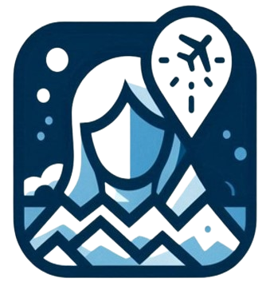

<p align="center">
  
</p>
<p align="center">
  
</p>

# Group 5
Students:
- Bianca Barbosa Zanol de Oliveira
- Fabricio L. Gardin
- Rafael Martins de Paiva Bastos

## Table of Contents

- [About ConnectGuides](#about)
- [Features](#features)
- [Technologies](#technologies)
- [Installation](#installation)
- [Usage](#usage)
- [API Endpoints](#api-endpoints)
- [Contact](#contact)

## About

ConnectGuides is a MERN stack application for connecting travelers with local guides. Users can browse available guide services, search for guides at specific locations, and book tours. Guides can register, list their services, and manage bookings.

## Features

- User registration and authentication
- Guide registration and service listing
- Browse and search for guide services by city
- Book guide services
- Manage bookings
- Upload and display images for guide services
- Responsive design

## Technologies

This project is built using the following technologies:

- **Frontend**: React
- **Backend**: Node.js, Express.js, MongoDB, Mongoose, Axios
- **Authentication**: JWT (JSON Web Tokens)
- **Styling**: Tailwind CSS

## Installation

### Prerequisites

- Node.js
- npm or yarn
- MongoDB instance

### Steps

1. Clone the repository:

```bash
git clone https://github.com/BiancaZO/ConnectGuides.git
cd connectguides
```

2. Install dependencies for both client and server:

```bash
cd client
yarn install

cd ../api
yarn install
```

3. Set up environment variables:

Create a .env file in the api directory with the following content:
```bash
MONGO_URL=mongodb://localhost:27017/connectguides
```

4. Start the development server:

```bash
# In the api directory
nodemon server

# In the client directory
yarn dev
```

5. Open your browser and navigate to http://localhost:5173.

## Usage
**1. User Registration and Authentication:**
- Users can sign up and log in to access the platform.
- Authentication is managed using JWT.
  
**2. Guide Registration and Service Listing:**
- Guides can register and list their services.
- Each service includes details such as title, city, photos, description, and price.
  
**3. Browse and Search for Guide Services:**
- Users can browse available services.
- The search functionality allows users to filter services by city.

**4. Booking Services:**
- Users can book guide services.
- Booking details include dates, number of travelers, and contact information.

**5. Manage Bookings:**
- Users can view and manage their bookings.

## API Endpoints
**Authentication**
- POST /register: Register a new user
- POST /login: Log in a user
  
**Guide Services**
- POST /guideService: Create a new guide service
- PUT /guideService: Update a guide service
- GET /guideService: Get all guide services
- GET /guideService/:id: Get a specific guide service
  
**Bookings**
- POST /bookings: Create a new booking
- GET /bookings: Get all bookings
- GET /bookings/:id: Get a specific booking

## Contact
For any questions or suggestions, please contact us.

> **⚠️ This application was developed as the final project for the Software Engineering course at Douglas College, Summer Semester of 2023.**
